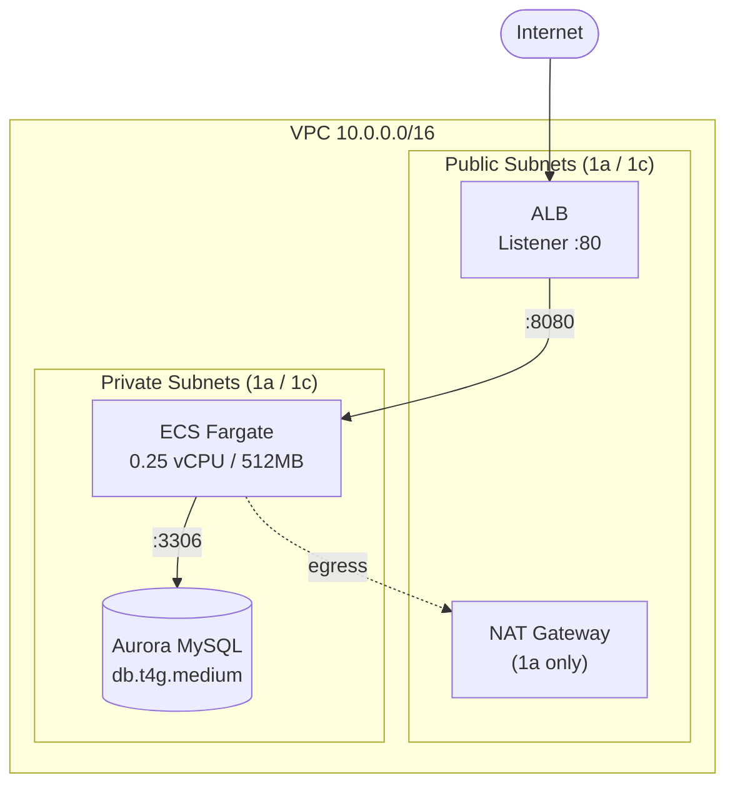

# Ticket Reservation API

## 概要
一時的な高負荷を想定したチケット予約APIの学習用プロジェクト。
Go/MySQL/Dockerでアプリケーションを実装して、AWS上の実行基盤をTerraformで構築しています。

## 現在のスコープ
| レイヤ | 状態 |
|---|---|
| アプリケーション（Go + MySQL） | Docker Compose でローカル動作。動作確認済み |
| AWSインフラ（Terraform） | VPC / ALB / ECS Fargate / Aurora MySQL まで構築・apply確認済み。**現在は削除済み** |
| アプリのAWSデプロイ | **未実装**。ECSタスク定義は動作確認用のコンテナを起動する構成のまま |

## 構成



## ディレクトリ構成

```
.
├── *.tf                    # AWSインフラ定義（Terraform）
│   ├── main.tf             # VPC / サブネット / ルーティング
│   ├── security_group.tf   # ALB / ECS / DB のセキュリティグループ
│   ├── alb.tf              # ALB / ターゲットグループ / リスナー
│   ├── ecs.tf              # ECSクラスター / タスク定義 / サービス
│   └── df.tf               # Aurora MySQL クラスター
└── ticket-reserve-api/     # アプリケーション
    ├── main.go
    ├── init.sql
    ├── Dockerfile
    └── docker-compose.yml
```

## 動作確認

### 起動

```bash
cd ticket-reserve-api
docker-compose up -d --build
```

>初回起動時のみ`init.sql`が実行されます。スキーマを変更した場合は `docker compose down -v` でボリュームごと削除してください。

### エンドポイント

**ヘルスチェック**

```bash
$ curl -i http://localhost:8080/health
HTTP/1.1 200 OK
Date: Wed, 05 Aug 2026 05:51:34 GMT
Content-Length: 2
Content-Type: text/plain; charset=utf-8

OK
```

**チケット一覧**

```bash
$ curl -s http://localhost:8080/tickets | jq
[
  {
    "id": "T001",
    "title": "Cirque du Soleil Tokyo",
    "price": 15000,
    "available": 42
  },
  {
    "id": "T002",
    "title": "Lion King",
    "price": 12000,
    "available": 5
  }
]
```

**予約**

```bash
$ curl -i -X POST http://localhost:8080/reserve \
> -H "Content-Type: application/json" \
> -d '{"ticket_id":"T001","amount":1}'
HTTP/1.1 200 OK
Content-Type: application/json
Date: Tue, 04 Aug 2026 22:38:45 GMT
Content-Length: 38

{"message":"Reservation successful!"}
```

### 同時実行時の在庫整合性

**在庫5枚のチケットに7回リクエスト → 200が5回、409が2回。**

```bash
$ for i in $(seq 1 7); do
  curl -s -o /dev/null -w "%{http_code}\n" -X POST http://localhost:8080/reserve \
    -H "Content-Type: application/json" \
    -d '{"ticket_id":"T002","amount":1}'
done
200
200
200
200
200
409
409
```

**20並列でリクエスト → 20件すべて成功し、在庫はちょうど20減少。**

```bash
$ seq 1 20 | xargs -P 20 -I{} curl -s -o /dev/null -w "%{http_code}\n" \
  -X POST http://localhost:8080/reserve \
  -H "Content-Type: application/json" \
  -d '{"ticket_id":"T001","amount":1}'
200
200
200
200
200
200
200
200
200
200
200
200
200
200
200
200
200
200
200
200
```

## 想定した非機能要件
| カテゴリ | 項目（SLI）　| 目標値（SLO）　｜根拠 |
|---|---|---|---|
| 可用性 | 予約APIの成功率（5xx以外の割合） | 月間稼働率 99.86% | メンテナンス時間として月当たり約1時間のダウンタイムを許容 |
| パフォーマンス | 予約APIのp99レイテンシ | 99%のリクエストが500ms以内 | 応答が1秒を超えるとユーザが不安から再送を繰り返し、自らDDoS状態を招くリスクがあるため |
| パフォーマンス | ピーク時のRPS | 1,000件/秒 | フォロワー10万人規模のSNS告知で、開始直後1秒に約1%が到達すると試算 |
| 運用・保守性 | IaCカバー率 | 本番環境のAWSリソースの100% | コンソールでの主導変更を排除し、設定ミスによる障害を防ぐため |

> 本表は目標とする水準であり、現在の実装は最小構成。差分は「今後の展望」に記載する

## 構成の検証
本プロジェクトの初期構成は、生成AIに要件を伝えて提案された技術スタックをベースにしている。
各技術を自身で比較検討して選定したわけではないため、ここでは「なぜこの構成が要件に合致しているのか」を、構築と動作検証を通じて後から検証した結果として記載する。

### ①在庫減算
SELECTで在庫を確認してからアプリケーション側で判定してUPDATEする実装では、同時リクエスト時に複数のリクエストが同じ在庫数を読み取ることで更新が失われ、結果として在庫がマイナスになる。
本実装では単一のSQL文（UPDATE tickets SET available = available - 1 WHERE id = ? AND available > 0）で在庫判定と減算を実施して、排他制御をRDBMSの行ロックで実施する構成を取っている。更新行数が0の場合は在庫切れまたは存在しないとして409を返す。
並列実行した20リクエストに対し、在庫がちょうど20減ること、在庫5枚のチケットに7回リクエストを実行して200が5回、409が2回返ることを確認済み。

### ②ALBのヘルスチェック
ヘルスチェックパスの初期設定が「/」だったが、アプリケーションは「/」をハンドラに登録していないため404を返す。ターゲットがすべてunhealthyと判定される構成だったため、「/health」に修正した。

### ③target_type = "ip"
Fargateはawsvpcモードでタスクごとに独自のENIとプライベートIPを持つため、ターゲットグループで`instance`タイプは選択できない。ALBはタスクのIPを直接ターゲットとして登録する。

### ④データベースの認証情報
当初はマスターパスワードをTerraformのコード内に平文で記載していた。tfvarsによる変数化ではstateに平文が残るため根本的な解決にならないと判断し、RDSのSecrets Manager統合を利用する構成に変更した。稼働中のクラスターに同じ変更を適用する場合は置換が発生する可能性があるため、本番環境ではplanでの差分確認とprevent_destroyが前提になる。

### ⑤CI
GitHub Actionsのワークフローは存在したが、トリガーブランチの指定が実際のブランチ名と異なっていたため一度も実行されていなかった。修正した上でgo vetを追加している。

## 設計上のトレードオフ

### ① NAT Gateway 1台
プライベートサブネットのアウトバウンド通信をNAT Gateway 1台（1a）に集約している。NAT Gatewayは1台当たり月額固定費が発生するため、検証環境としてコストを優先した。
ただし、現在の構成では1a側で障害発生時にプライベートサブネット全体のアウトバウンド通信が停止するため、本番環境では各AZに配置する必要がある。

### ② Auroraインスタンス 1台
DBサブネットグループは1a/1cにまたがっているが、インスタンスは1台のみでリーダーは持たない。日機能要件ではRTO60秒以内のマルチAZ構成を想定しているが、現状はフェイルオーバー先が存在しない。

### ③ ALBがHTTPのみ
リスナーはHTTP:80のみで、HTTPSは未設定である。セキュリティグループでは443を許可しているが、対応するリスナーとHTTPS化用のACM証明書は用意していない。検証環境のため、ドメイン取得と証明書発行は未実施。

### 予約レコードを持たない
ticketsテーブルの在庫カウンタを増減するのみで、予約履歴のテーブルを持たない。誰がいつ、何枚予約したかは記録されないため、現状は在庫管理の仕組みであって予約システムとしては不完全な状態。また、リクエストのamountフィールドは受け取っているが未使用で、常に1枚として処理される。

## 今後の展望

**アプリケーションのデプロイ**
- ECRへのイメージ登録と、ECSタスク定義の差し替え
- コンテナポートとターゲットグループのポート整合（現在80/8080が不一致）
- `logConfiguration` の記述修正（現在CloudWatch Logsに未接続）

**可用性**
- ECSタスクのマルチAZ配置とdesired countの引き上げ
- Auroraのリーダーインスタンス追加によるマルチAZ化
- NAT Gatewayの各AZ配置

**パフォーマンス**
- 負荷試験の実施（非機能要件で想定した1000RPSに対する限界値の測定）
- SQSによる非同期受付の検討
- ElastiCacheによる読み取り負荷の軽減

**セキュリティ**
- ACM証明書の取得とHTTPSリスナーの追加
- AWS WAFのレートベースルール導入

**運用・保守性**
- Terraform stateのS3バックエンド化とDynamoDBによるロック
- CIへのテスト追加、コンテナイメージの脆弱性スキャン
- Goバージョンの二重管理解消（go.modとワークフローで重複）

**機能**
- 予約レコードテーブルの追加
- `amount` フィールドの実装
